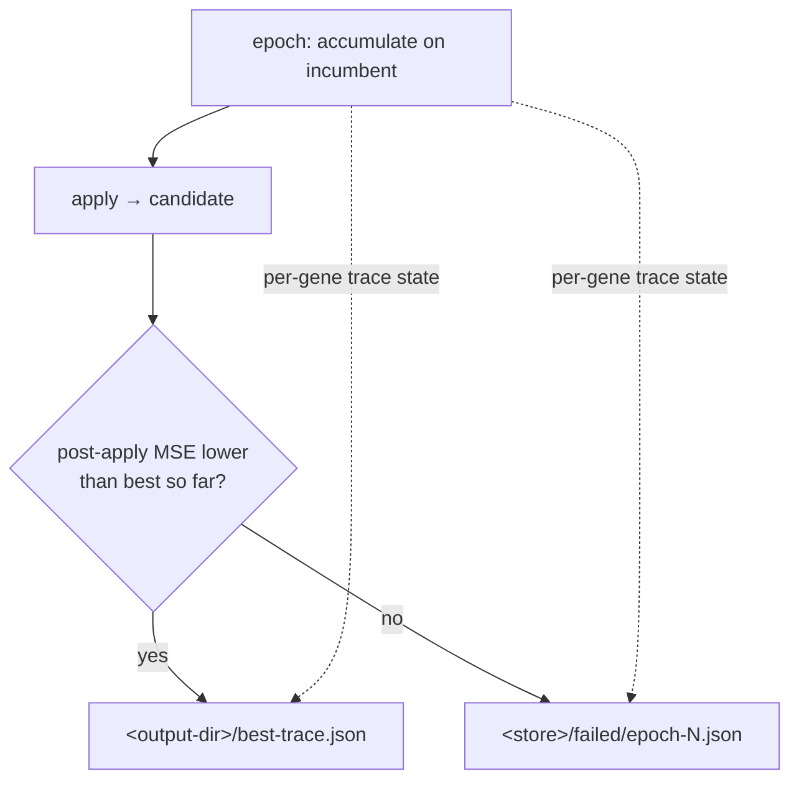

# train: honour NEAT-AI traceStore / export CreatureTrace (Issue #78)

## Summary

`train` ran the traced forward pass but threw the trace away, so a rejected
epoch left nothing to diagnose and NEAT-AI's `RustTrainDirBridge` had to
synthesise `bestTraceJSON` from a `best.json` that carries no accumulated
state. `train --trace-store DIR` now writes NEAT-AI `CreatureTrace` artifacts
straight from the epoch that produced them. Closes #78.

- **`--trace-store DIR`** (documented in `train --help`). An epoch that lowered
  the best MSE writes `best-trace.json` beside `best.json`; one that did not
  writes `<store>/failed/epoch-<N>.json` — the same failed-candidate store
  `TrainOptions.traceStore` fills in TypeScript. The split keys off the MSE, not
  the accept flag, so under `--accept-always` a kept-but-worse candidate is
  still filed as failed. Omitting the flag writes nothing.
- **`trace.rs`** serialises the NEAT-AI wire format: the UUID-only creature
  export (produced by `neat_core`'s own serialisation, so no creature field is
  restated here) with a `trace` object on every gene the epoch accumulated.
  Neuron `trace` is NEAT-AI `NeuronState`, synapse `trace` is `SynapseState`. A
  zero-count gene carries no `trace` key and constant neurons are never traced,
  matching `traceJSON()`'s own guards. A gene-count mismatch between creature
  and pass is a loud error, not a partly populated artifact.
- **`AccumulateReport.neuron_traces`** gathers the `NeuronState` fields that are
  *not* part of a learning proposal — activation range, hint value, raw bias and
  absolute-error mass — which the learning accumulators had been discarding.
  Gathered unconditionally (a handful of adds per neuron per record, against a
  loop that already allocates per record) so an epoch never has to accumulate
  twice.

Genes in an artifact are the **candidate** the epoch produced; the `trace` state
is the accumulation over the incumbent that proposed it. That is the pairing
NEAT-AI writes, and it is what makes a rejected candidate readable — the weights
that were tried, beside the evidence that argued for them.

The third acceptance criterion (the NEAT-AI bridge setting the flag from
`TrainOptions.traceStore` and attaching the trace to `TrainingResult.trace`)
lands in the consumer repo once a human releases this crate — see the follow-up
linked in the issue.

## Evidence

Backend/CLI only — no web interface to screenshot. Evidence is the test suite
plus a real CLI run.



Identity chain (`1 → 1.5`), one record, `--learning-rate 1.0 --step-scale 1.0`
so the full single-gene step overshoots and the apply is rejected:

```console
$ neat_ai_backpropagation train creature.json data \
    --epochs 1 --learning-rate 1.0 --step-scale 1.0 --max-backtracks 0 \
    --output-dir out --trace-store store
epoch 1: before_mse=0.250000000000 after_mse=0.390625000000 accepted=false ...
$ cat store/failed/epoch-1.json
{
  "forwardOnly": true,
  "input": 1,
  "neurons": [
    { "bias": 0.25, "squash": "IDENTITY", "type": "hidden", "uuid": "h1",
      "trace": { "count": 1.0, "hintValue": 1.0, "maximumActivation": 1.0,
                 "minimumActivation": 1.0, "noChange": false,
                 "totalActivation": 1.0, "totalAdjustedBias": 0.5,
                 "totalBias": 0.5, "totalErrorAbsolute": 0.5 } },
    …
  ],
  "synapses": [
    { "fromUUID": "input-0", "toUUID": "h1", "weight": 1.25,
      "trace": { "count": 1.0, "countNegativeActivations": 0.0,
                 "countPositiveActivations": 1.0,
                 "totalNegativeActivation": 0.0,
                 "totalNegativeAdjustedValue": 0.0,
                 "totalPositiveActivation": 1.0,
                 "totalPositiveAdjustedValue": 1.5 } },
    …
  ]
}
```

`./quality.sh` passes (fmt, clippy `-D warnings`, cargo-deny, codespell,
shellcheck, actionlint, workflow validators, tests, rustdoc).

## Test Plan

`backpropagation/tests/trace_store.rs` — end-to-end round trip:

- `rejected_epoch_writes_a_failed_trace_with_uuid_endpoints` — the issue's
  acceptance round trip: small creature + tiny `.bin` dir → rejected apply →
  non-empty `failed/epoch-1.json` whose neurons carry UUIDs, whose synapses
  carry `fromUUID` / `toUUID`, and whose `trace` objects deserialise into
  `NeuronTraceState` / `SynapseTraceState` with non-zero counts.
- `improving_epoch_writes_the_best_trace_beside_best_json` — an accepted epoch
  writes `best-trace.json` next to `best.json` and no failed artifact.
- `without_a_trace_store_no_trace_artifact_is_written` — the flag is opt-in.
- `a_missing_trace_store_directory_is_created` — a nested store path is created
  rather than failing the run.
- `train_help_documents_the_trace_store_flag` — runs the built binary and
  asserts `train --help` documents `--trace-store`.

`backpropagation/src/trace.rs` unit tests:

- `trace_carries_uuid_endpoints_and_accumulated_state` — every `NeuronState` /
  `SynapseState` field maps from the pass it came from.
- `genes_without_accumulation_carry_no_trace` — zero-count genes and constant
  neurons carry no `trace` key.
- `trace_preserves_the_creature_export` — stripping the `trace` keys returns the
  creature export byte for byte, so a trace also loads as a creature.
- `mismatched_report_is_rejected` — a pass that does not line up with the
  creature fails loud.
- `write_creates_the_store_directory` — the artifact round-trips through disk.

Existing `TrainRequest` call sites gained `trace_store: None`; no test was
removed or weakened.
