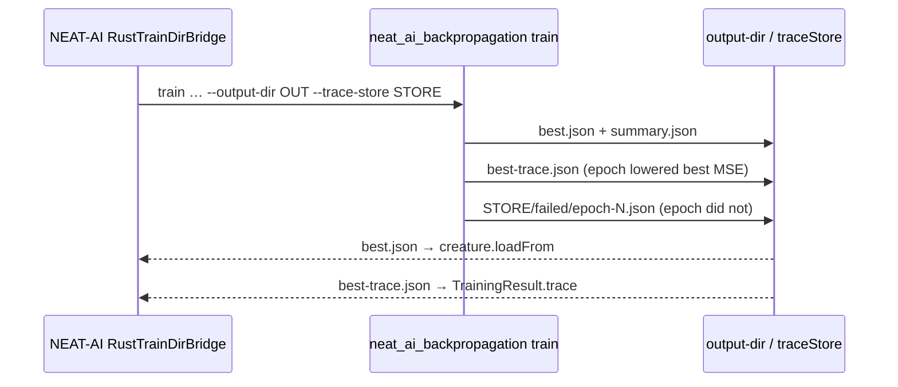

# NEAT-AI bridge: forward traceStore to `--trace-store` (Issue #81)

## Summary

The consumer half of #78 — `RustTrainDirBridge` setting `--trace-store` from
`TrainOptions.traceStore` and attaching the epoch's trace to
`TrainingResult.trace` — lives in `stSoftwareAU/NEAT-AI`, so the fix was made
there, in its own repo, and this PR records it beside the CLI it consumes.
Closes #81.

- **`stSoftwareAU/NEAT-AI` branch `issue-81-rust-traindir-trace-store`**
  (commit `41f247a3`, pushed; a human must open the PR — see below) —
  `buildTrainArgs` now
  appends `--trace-store <resolved dir>` when `TrainOptions.traceStore` is set,
  and `loadBestTrace` reads `<output-dir>/best-trace.json` back as
  `TrainingResult.trace` instead of synthesising one with `creature.traceJSON()`
  from a `best.json` that carries no accumulated state. The bridge also switched
  its loop export to `exportJSONWithRuntimeIds`, because NEAT-AI's teardown maps
  each traced gene to the sparse config through the export's integer ids and a
  UUID-only export dropped every trace it was handed.
- **This repo — `README.md`** — the trace-store section now names both ends of
  the store: what the CLI writes, and what the bridge does with it. A binary
  that predates the flag fails the run loudly with clap's unknown-argument
  error, which is the intended signal to rebuild the sibling checkout.

No Rust change was needed: `train --trace-store` shipped in #80 and is on
`Develop` at `neat_ai_backpropagation` 0.1.17.

**A human must open the NEAT-AI PR.** The branch is pushed and its quality gate
is green, but `gh pr create` against `stSoftwareAU/NEAT-AI` is refused by this
run's write allowlist (`WRITE_REPO_BLOCKED`). Open it from
<https://github.com/stSoftwareAU/NEAT-AI/pull/new/issue-81-rust-traindir-trace-store>
against `Develop`; the PR body is
`docs/archive/pr-summaries/pr-summary-backprop-81.md` on that branch. Issue #81
carries `needs-human` for this reason.

**On the "blocked on a human release" note in the issue.** It does not apply.
NEAT-AI does not depend on a published version of this crate — `RustTrainDirBridge`
resolves a locally built binary (`NEAT_AI_BACKPROP_BINARY_PATH`, then
`./target/release/`, then the sibling checkout) and the whole path is opt-in
behind `NEAT_AI_BACKPROP_ENABLED=1`. There is no version pin to bump, so nothing
was pinned to a commit or a pre-release to pull the fix in early.

## Evidence

Backend/CLI only — no web interface to screenshot. Evidence is the two test
suites plus both quality gates.

- `./quality.sh` in this repo passes (shellcheck, actionlint, workflow
  validators, codespell, cargo-deny, fmt, clippy `-D warnings`, tests,
  rustdoc) — this PR is documentation only, so the Rust suite is unchanged.
- `./quality.sh` in `stSoftwareAU/NEAT-AI` passes with the bridge change and its
  new tests.

## Test Plan

The behaviour under test is the bridge's, so the tests live with it in
`stSoftwareAU/NEAT-AI` — `test/architecture/training/RustTrainDirBridge.ts`:

- `traceStore is forwarded as --trace-store` / `no traceStore means no
  --trace-store` — the built argument list carries the resolved store path, and
  the flag stays opt-in.
- `best-trace.json is loaded when written` — an absent artifact reads as
  `undefined`; a written one round-trips with its per-gene state.
- `a malformed best-trace.json fails loud` — a JSON blob that is not a
  `CreatureTrace` throws naming the artifact rather than degrading to a
  stateless trace.
- `the epoch trace lands on TrainingResult.trace` — end-to-end through
  `tryRustTrainDir` against a stand-in binary that records its arguments and
  emits the three artifacts. It asserts the CLI was given `--trace-store` and
  that the distinctive `trace.count` from `best-trace.json` survives teardown.
  This test fails against the previous
  `creature.exportJSON()` / `creature.traceJSON()` pair, so it is the regression
  guard for both halves of the change.

This repo's own round trip for the artifacts
(`backpropagation/tests/trace_store.rs`, added by #80) is unchanged and still
passes.
