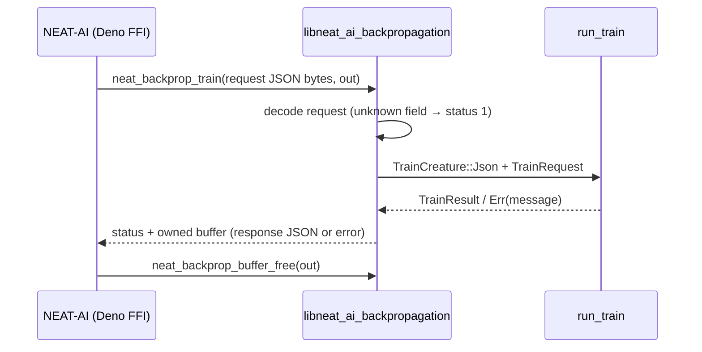

# PR Summary — Issue #84

## Summary

NEAT-AI reached this crate only by **spawning** the CLI
(`RustTrainDirBridge.ts`), paying a process launch and a JSON temp
directory on every memetic `trainDir`. This change ships the same `train`
contract as a `cdylib` C ABI a Deno FFI (or any C) caller can `dlopen`.
Closes #84.

- `backpropagation/Cargo.toml` — `crate-type = ["cdylib", "rlib"]`, so the
  release build produces `libneat_ai_backpropagation.{dylib,so,dll}`
  beside the existing binary while the CLI and native tests keep linking
  the rlib.
- `backpropagation/src/ffi.rs` — the ABI: `neat_backprop_train`
  (UTF-8 JSON in, an owned `NeatBackpropBuffer { data, len, capacity }`
  out), `neat_backprop_buffer_free`, and the `neat_backprop_abi_version` /
  `neat_backprop_version` probes.
- `include/neat_ai_backpropagation.h` — the documented C declarations and
  the request / response shape.
- `train.rs` — `TrainRequest.creature` is now `TrainCreature::{Path, Json}`
  so an in-process caller passes the **creature JSON text** (UUID-only
  export) rather than a path, and `TrainResult` gained `best_json` — the
  exact bytes written to `best.json` — so the ABI returns the trained
  creature without re-reading it.

Every CLI `train` flag NEAT-AI already forwards is a request field,
defaulting to the CLI value: `epochs`, `maxRecords`, `seed`,
`disableRandomSamples`, `learningRate`, `learningRateStrategy`,
`learningRateDecay`, `normaliseGradients`,
`maximumBiasAdjustmentScale`, `maximumWeightAdjustmentScale`, `stepScale`,
`outputsOnly`, `hiddenOnly`, `acceptAlways`, `maxBacktracks`, `scorer`,
`traceStore`. The record sampling (#77) and trace store (#78) work is
therefore reachable from the ABI, not only from the CLI.

**Fail-loud, no silent fallback.** A null pointer, non-UTF-8 bytes, an
unknown request field, a malformed request, a trainer error, or a panic
caught at the boundary all return a non-zero status **and** put the
message in the same out buffer — a caller can never read an empty buffer
as success.

| Status | Meaning |
| ------ | ------- |
| `0` `NEAT_BACKPROP_OK` | Buffer holds the response JSON |
| `1` `NEAT_BACKPROP_ERR_INVALID_ARGUMENT` | Null / non-UTF-8 / malformed request |
| `2` `NEAT_BACKPROP_ERR_TRAIN_FAILED` | The trainer failed; buffer holds its message |
| `3` `NEAT_BACKPROP_ERR_PANIC` | A panic was caught at the boundary |

Retiring the process spawn on the NEAT-AI side is a follow-up in that
repository — this crate only owns the library it `dlopen`s.

## Evidence

Backend / library change with no web interface, so there is no screenshot.
The evidence is the built `cdylib`, its exported symbols, and the ABI
tests.



Release build produces the library and exports the four symbols:

```text
$ cargo build --release -p neat_ai_backpropagation
    Finished `release` profile [optimized] target(s) in 43.46s
$ ls target/release/libneat_ai_backpropagation.*
target/release/libneat_ai_backpropagation.dylib
target/release/libneat_ai_backpropagation.rlib
$ nm -gU target/release/libneat_ai_backpropagation.dylib | grep neat_backprop
000000000001df70 T _neat_backprop_abi_version
000000000001df78 T _neat_backprop_buffer_free
000000000001dfc0 T _neat_backprop_train
000000000001e21c T _neat_backprop_version
```

ABI tests, driving the raw pointer contract:

```text
$ cargo test --workspace --all-features --test ffi_abi -- --test-threads=2
running 12 tests
test a_null_out_pointer_is_rejected_without_a_crash ... ok
test a_null_request_pointer_is_rejected_without_a_crash ... ok
test a_recurrent_creature_fails_loudly ... ok
test a_missing_training_directory_fails_loudly ... ok
test freeing_a_null_buffer_is_a_no_op ... ok
test malformed_request_json_reports_an_invalid_argument ... ok
test apply_filters_are_forwarded ... ok
test train_accepts_an_improving_epoch ... ok
test train_reports_trace_artifacts ... ok
test train_reports_the_failed_trace_store ... ok
test version_probes_match_the_crate ... ok
test train_round_trips_a_tiny_creature_and_bin_dir ... ok

test result: ok. 12 passed; 0 failed
```

`./quality.sh` passes end to end (cargo-deny, fmt, clippy `-D warnings`,
the full workspace test suite, and `cargo doc` with
`RUSTDOCFLAGS="-D warnings"`).

## Test Plan

New — `backpropagation/tests/ffi_abi.rs` (12 tests) calls the exported
symbols exactly as a Deno FFI caller does: raw request bytes in, owned
buffer out, buffer freed.

- `train_round_trips_a_tiny_creature_and_bin_dir` — a tiny creature plus a
  `.bin` directory round-trips; the response's `bestCreatureJson` parses
  and matches the bytes on `bestPath`, and `journalPath` holds the run
  header.
- `train_accepts_an_improving_epoch` — a learnable corpus accepts an epoch
  and lowers MSE, so the ABI reaches the same learning as the CLI path.
- `train_reports_trace_artifacts` / `train_reports_the_failed_trace_store`
  — `traceStore` (#78) is reachable from the ABI: an improving epoch
  reports `best-trace.json`, a rejected one reports `<store>/failed/`.
- `apply_filters_are_forwarded` — `outputsOnly` + `hiddenOnly` select no
  genes, so nothing is accepted and MSE is unchanged.
- `malformed_request_json_reports_an_invalid_argument`,
  `a_recurrent_creature_fails_loudly`,
  `a_missing_training_directory_fails_loudly` — each failure carries a
  non-zero status *and* a message in the buffer; a rejected run leaves no
  `best.json` behind.
- `a_null_request_pointer_is_rejected_without_a_crash`,
  `a_null_out_pointer_is_rejected_without_a_crash`,
  `freeing_a_null_buffer_is_a_no_op` — the pointer contract holds at its
  edges, and `free` resets the buffer to empty.
- `version_probes_match_the_crate` — both probes match
  `CARGO_PKG_VERSION` / `NEAT_BACKPROP_ABI_VERSION`.

New unit tests in `backpropagation/src/ffi.rs`:

- `defaults_mirror_the_cli_train_flags` — every omitted request field
  resolves to the CLI `train` default (parity criterion).
- `unknown_request_fields_fail_loudly` — a typo'd field is rejected, not
  silently defaulted.
- `strategy_names_are_camel_case_on_the_wire` — `warmRestart` maps onto
  `LearningRateStrategy::WarmRestart`.
- `version_probe_reports_the_crate_version`.

Existing tests were kept and only updated mechanically for the
`TrainRequest.creature: TrainCreature` field
(`train.rs`, `forward_only_guard.rs`, `record_sampling.rs`,
`trace_store.rs`); no test was removed, disabled, or weakened.
