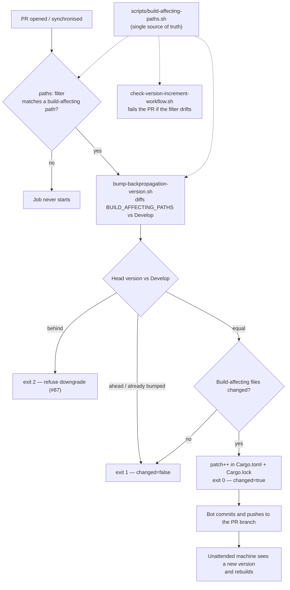

# Auto-bump the crate version on every build-affecting change

## Summary

Unattended machines rebuild `neat_ai_backpropagation` **only** when the crate
version moves — `ensure_lib_built()` in the consumers' `runlib.sh` compares an
installed version marker against `cargo metadata` and skips the build when they
match. The CI auto-bump only watched `backpropagation/src/**`, so a PR that
changed dependencies (`backpropagation/Cargo.toml`, `Cargo.lock`), the release
profile (`Cargo.toml`), the compiler flags (`.cargo/config.toml`), the toolchain
(`rust-toolchain.toml`) or the C ABI header (`include/**`) shipped a different
artefact under an unchanged version — and remotes kept running the stale
library.

This widens the auto-bump to the full build-affecting set and makes that set a
single source of truth:

- **`scripts/build-affecting-paths.sh` (new)** — declares `BUILD_AFFECTING_PATHS`
  once, plus `build_affecting_pathspecs()` to convert the GitHub Actions globs
  to git pathspecs. Sourced by both consumers below.
- **`scripts/bump-backpropagation-version.sh`** — diffs every build-affecting
  pathspec instead of the single `backpropagation/src` path, and lists the
  changed files it bumped for. All existing behaviour is unchanged: downgrades
  still fail loud (exit 2, issue #87), an already-ahead version or an existing
  auto-increment commit still skips (exit 1, idempotent).
- **`.github/workflows/version-increment.yml`** — the `paths:` filter now lists
  every build-affecting path, so the job actually *starts* on those PRs. A path
  missing from the filter is silent: the job never runs, nothing fails, and the
  remote keeps the stale library.
- **`scripts/check-version-increment-workflow.sh`** — new rule 7 parses the
  workflow's `paths:` list and fails the PR when a `BUILD_AFFECTING_PATHS` entry
  is missing, so the two lists cannot drift apart.
- **`quality.sh` / `.github/workflows/ci.yml`** — run both new test suites.

Deliberately excluded from the bump set: `backpropagation/tests/` (integration
tests are not linked into the cdylib/rlib), docs and CI config — a docs-only PR
must not force a version bump.

Closes #95.

## Evidence

This is a CI/CLI change with no web interface, so there is no screenshot to
capture. The evidence is the two new shell test suites, which build a real
throwaway git repository, run the real bump script against it, and assert on
exit codes and rewritten file contents.



`./scripts/test-bump-backpropagation-version.sh` — 13 passed, 0 failed:

```text
OK   src change bumps
OK   crate Cargo.toml dependency change bumps
OK   workspace Cargo.toml profile change bumps
OK   Cargo.lock dependency change bumps
OK   .cargo/config.toml rustflags change bumps
OK   rust-toolchain.toml change bumps
OK   include/ FFI header change bumps
OK   docs-only change skips
OK   integration-test-only change skips
OK   real run bumps
OK   manifest patched to 0.1.11
OK   lockfile patched to 0.1.11
OK   re-run after a bump is a no-op
```

`./scripts/test-check-version-increment-workflow.sh` — 10 passed, 0 failed:

```text
OK   committed workflow passes
OK   missing workflow file fails loudly
OK   compliant fixture passes
OK   paths filter missing Cargo.lock fails
OK   paths filter missing .cargo/config.toml fails
OK   no pull_request trigger fails
OK   no contents: write permission fails
OK   no bump script invocation fails
OK   unconditional commit/push fails
OK   no fork guard fails
```

### Quality gate

`./quality.sh` passes through every gate — shellcheck, all workflow validators,
`actionlint`, `cargo deny check` (advisories/bans/licenses/sources ok),
`cargo fmt --check`, `cargo clippy -D warnings`, `cargo doc -D warnings` — with
two environment caveats:

1. **codespell is not installable in this container** (`python3 -m pip` reports
   `No module named pip`), so the local spell-check preflight aborts with
   `spell-check: codespell is not installed.` CI runs it for real. Every word
   added here (including `artefact`) already appears in `README.md` /
   `CHANGELOG.md` on `Develop` and passes that job.
2. **`backpropagation/tests/observation_width.rs` fails against the local
   `neat-core` head (v0.9.9)** with
   `InvalidInputCount { found: 0 }`. This is pre-existing and unrelated:
   `git diff --quiet origin/Develop..HEAD -- backpropagation Cargo.toml Cargo.lock`
   is clean, so this branch changes no Rust at all. It is already tracked by
   **#96**.

### This PR does not need a version bump

None of the files changed here is in `BUILD_AFFECTING_PATHS`, so the bump job
correctly reports `changed=false` — which is itself the behaviour under test.

## Test Plan

- Added `scripts/test-bump-backpropagation-version.sh` — 13 assertions against a
  real git fixture repository. One test per build-affecting path proving it
  triggers a bump (this is the regression test for #95: each of
  `backpropagation/Cargo.toml`, `Cargo.toml`, `Cargo.lock`,
  `.cargo/config.toml`, `rust-toolchain.toml` and `include/` fails against the
  old `SRC_PATH="backpropagation/src"` implementation), plus negative tests
  (docs-only, integration-test-only), a real non-`--check` run asserting both
  the manifest and the lockfile are rewritten to `0.1.11`, and an idempotency
  test.
- Added `scripts/test-check-version-increment-workflow.sh` — 10 assertions. The
  committed workflow passes; a missing file fails loudly; and each rule is
  proven to bite by mutating a compliant fixture one rule at a time, including
  dropping `Cargo.lock` and `.cargo/config.toml` from the `paths:` filter.
- Both suites wired into `quality.sh` and the CI `quality` job, so the two path
  lists cannot drift apart unnoticed.
- Updated `CONTRIBUTING.md` (build-affecting path table) and `CHANGELOG.md`.
