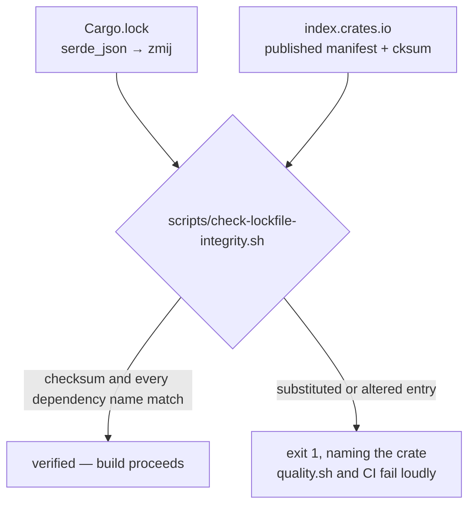

# Issue #148 — `serde_json` → `zmij` in `Cargo.lock`

Issue #148 (`security-scan`, severity high, confidence medium) reported that
`Cargo.lock` records `serde_json` 1.0.151 depending on a crate named `zmij`
where `ryu` — `serde_json`'s long-standing float-formatting dependency — was
expected, and flagged it as a possible supply-chain substitution. The scan was
static-only and said so: it had no registry access to resolve `zmij`.

## Verdict — not a substitution

`zmij` is the legitimate successor to `ryu`, published by the same author, and
the lockfile matches what crates.io actually serves. Checked against the
crates.io API and sparse index on 2026-09-10:

| Evidence | Value |
| --- | --- |
| Owner of `zmij` | `dtolnay` (David Tolnay) — the author of `ryu`, `serde` and `serde_json` |
| Repository | `https://github.com/dtolnay/zmij` |
| Description | "A double-to-string conversion algorithm based on Schubfach and xjb" |
| First published | 2025-12-18; 37 versions; ~409M downloads |
| `zmij` 1.0.23 `cksum` | `29666d0abbfad1e3dc4dcf6144730dd3a3ab225bbbdac83319345b1b44ccfc1b` — identical to the lockfile |
| `serde_json` 1.0.151 `cksum` | `c841b55ecdae098c80dcae9cf767f6f8a0c2cdb3416bbef72181df4d0fe73f14` — identical to the lockfile |
| `serde_json` 1.0.151 built dependencies, per its published manifest | `indexmap` (optional), `itoa`, `memchr`, `serde`, `serde_core`, `zmij` |

`ryu` is absent from the lockfile because `serde_json` 1.0.151 no longer
declares it — the crate swapped its float formatter upstream. Both names are a
dragon (`ryu`, Japanese; `zmij`, Slavic), which is the naming continuity, not a
coincidence to be read as camouflage. No change to `Cargo.lock` was warranted,
and none was made; `zmij` was **not** added to `deny.toml`'s ban list, because
banning it would ban `serde_json`.

## The artefact actually compiled

The table above resolves the *published record*. The issue also asked what the
downloaded crate contains — its exploit sketch turned on `zmij` carrying "a
`build.rs` or proc-macro that runs arbitrary code at compile time", which the
static scan could not check. Inspected on disk, in this container's
`CARGO_HOME` after a full build:

| Check | Result |
| --- | --- |
| `sha256sum` of the cached `zmij-1.0.23.crate` | `29666d0abbfad1e3dc4dcf6144730dd3a3ab225bbbdac83319345b1b44ccfc1b` — identical to the registry `cksum` and to `Cargo.lock` |
| Is it a proc-macro crate? | No — its manifest declares no `proc-macro` target and no `links` key |
| Does it have a `build.rs`? | Yes, and it is the ordinary rustc-version probe |

The build script runs `$RUSTC --version`, parses the minor version, and emits
`cargo:rustc-check-cfg` / `cargo:rustc-cfg` lines to gate two things: the
`std::hint::select_unpredictable` intrinsic on rustc < 1.88, and a
size-optimised code path when `OPT_LEVEL` is `s` or `z`. It opens no network
connection, reads no file, and writes nothing outside cargo's own directives —
it is the same probe dtolnay ships in `serde` and `ryu`. Nothing was cleared
from the cache, because the cached artefact is the published one.

## What did change

The finding was undecidable from the lockfile alone, which is the real gap: a
genuine substitution and a legitimate upstream rename read identically. `cargo`
does not compile a substituted entry — measured on this repository, it
re-resolves against the crate's real manifest and silently rewrites the
lockfile back (with the network and with `--offline`), and under `--locked` it
refuses with a generic "cannot update the lock file" error that names no crate.
Neither response tells a reviewer which it was looking at. That comparison is
now a gate — `scripts/check-lockfile-integrity.sh`, run by `quality.sh` and CI
— which fetches the crates.io sparse index for every registry package in
`Cargo.lock` and fails loudly when a checksum or a recorded dependency name
disagrees with what was published. A future substitution fails CI; a future
`zmij` verifies clean and needs no human adjudication.

## Provenance

Recorded from `docs/archive/pr-summaries/pr-summary-148.md`. Filing status: no
upstream filing is needed — the finding was a false positive about an external
crate, and nothing in `stSoftwareAU/*` is defective.
